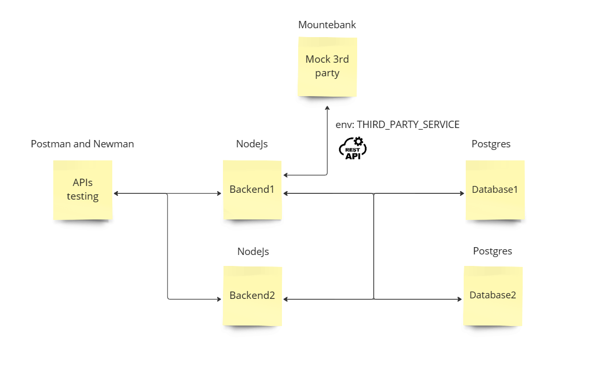

## Post test

Clone project นี้ลงมาและสร้าง Dockerfile หรือ docker-compose เพื่อสร้าง containers ตามรูปภาพด้านล่าง



**1. Database1:** สร้าง docker container และนำ file sql ใน folder database1 ไปใช้โดยเริ่มจาก file table ก่อนแล้วตามด้วย file data

**2. Database2:** สร้าง docker container และนำ file sql ใน folder database2 ไปใช้โดยเริ่มจาก file table ก่อนแล้วตามด้วย file data

**3. Mountebank:** ใน folder mountebank/imposters จะมีไฟล์ third_party.json ให้เขียน REST APIs methord GET return ค่าด้านล่าง

```
Note: Content-Type: application/json

[
    {
        "id": 1,
        "name": "Leanne Graham",
        "username": "Bret",
        "email": "Sincere@april.biz",
        "address": {
            "street": "Kulas Light",
            "suite": "Apt. 556",
            "city": "Gwenborough",
            "zipcode": "92998-3874",
            "geo": {
                "lat": "-37.3159",
                "lng": "81.1496"
            }
        },
        "phone": "1-770-736-8031 x56442",
        "website": "hildegard.org",
        "company": {
            "name": "Romaguera-Crona",
            "catchPhrase": "Multi-layered client-server neural-net",
            "bs": "harness real-time e-markets"
        }
    },
    {
        "id": 2,
        "name": "Ervin Howell",
        "username": "Antonette",
        "email": "Shanna@melissa.tv",
        "address": {
            "street": "Victor Plains",
            "suite": "Suite 879",
            "city": "Wisokyburgh",
            "zipcode": "90566-7771",
            "geo": {
                "lat": "-43.9509",
                "lng": "-34.4618"
            }
        },
        "phone": "010-692-6593 x09125",
        "website": "anastasia.net",
        "company": {
            "name": "Deckow-Crist",
            "catchPhrase": "Proactive didactic contingency",
            "bs": "synergize scalable supply-chains"
        }
    }
]
```

**4. Backend1:** มี Dockerfile ให้ ต้องเขียน Docker-compose เพื่อเรียกใช้งานมัน จากนั้นให้เขียน config เพื่อเชื่อมต่อกับ Database1, Database2 และ Mountebank

* Database1 ถูกเรียกใช้จาก file merchant.js
* Database2 ถูกเรียกใช้จาก file user.js
* Third party ถูกเรียกใช้จาก file index.js (env: THIRD_PARTY_SERVICE)

**5. Backend2:** มี Dockerfile ให้ ต้องเขียน Docker-compose เพื่อเรียกใช้งานมัน จากนั้นให้เขียน config เพื่อเชื่อมต่อกับ Database1 และ Database2

* Database1 ถูกเรียกใช้จาก file pet.js
* Database2 ถูกเรียกใช้จาก file food.js

**6. APIs testing:** มี Dockerfile ให้ ต้องเขียน Docker-compose เพื่อเรียกใช้งานมันทดสอบ Backend1 และ Backend2 <ins>ถ้า report ออกมาผ่านทั้งหมดถือว่าคุณทำสำเร็จแล้วยินดีด้วย</ins>